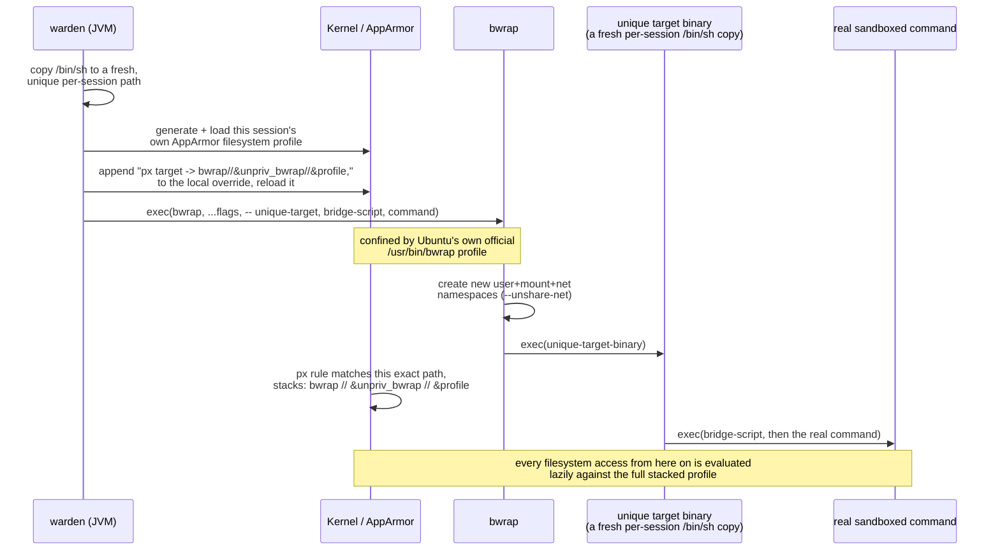
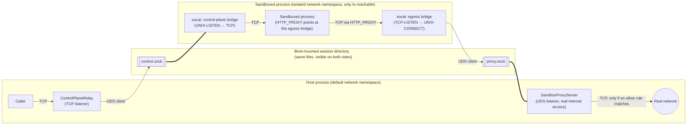

# warden

An OS-level process sandbox for JVM host applications: kernel-enforced filesystem and
network-egress confinement for a subprocess you launch, using each platform's own native
sandboxing primitive - Seatbelt (`sandbox-exec`) on macOS, AppArmor + `bwrap` on Linux.

## What it is, and when to use it

warden wraps `ProcessBuilder`-style process launches in a real, kernel-enforced sandbox.
You give it a filesystem allow/deny rule list and a network host allowlist. It launches
your command inside a boundary the sandboxed process cannot see past, bypass, or
influence - not a convention the process is expected to cooperate with.

Good fit: any JVM application that runs untrusted or semi-trusted subprocesses and needs
real isolation - agent tool-execution (an LLM-driven shell/bash tool), plugin sandboxes,
CI job runners, anything that shells out to code it doesn't fully trust.

Not a fit: multi-tenant container/VM-level isolation. warden confines one process tree on
the *existing* kernel. It does not virtualize one.

## How it differs from other approaches in this space

- Most tools in this space ship as a separate CLI/runtime with its own language-ecosystem
  dependency (commonly Node.js). warden is a native JVM library with zero non-JDK runtime
  dependency, embedded directly into the host process rather than shelled out to.
- Container/VM-based sandboxing trades weight (a container runtime/daemon, per-container
  overhead) for isolation strength. warden uses OS-native primitives directly (Seatbelt
  profiles, Linux namespaces + a Linux Security Module) - lighter, no daemon, per-process
  rather than per-container.
- A common simplification other Linux sandboxing tools take, once they hit Ubuntu
  23.10+'s unprivileged-userns restriction, is globally unconfining the
  namespace-creation binary for *every* process on the machine. That closes the
  restriction's error message but reopens a real gap: any process that execs that binary - not
  just the intended sandboxed one - silently gains unconfined status. warden
  instead does genuine per-session AppArmor profile stacking, scoped to exactly the one
  session being launched - no global unconfinement, at the cost of being a less-trodden
  path (see Limitations below).
- Network egress in many lightweight approaches relies on `HTTP_PROXY`/`HTTPS_PROXY`
  environment variables alone - a convention a subprocess can simply ignore (raw sockets,
  `--noproxy` flags, proxy-unaware runtimes). warden's Linux egress control is backed by a
  real, kernel-enforced network namespace with no route out except through the proxy
  relay it builds - ignoring the env vars still doesn't reach the network.

## Design rationale: why this, not that

A few of warden's design choices came from real dead ends, not just picking the obvious
option first. Worth knowing before you dig into the implementation:

**Linux filesystem enforcement is AppArmor, not fanotify.** A `fanotify`-based design was
built and spiked first - `FAN_MARK_FILESYSTEM` was the only mark scope that actually
worked across a bind-mounted sandbox boundary, but it covers the *entire* filesystem, not
just sandboxed sessions: the listener process becomes the real-time permission authority
for every process on that filesystem, sandboxed or not. A dedicated listener-death spike
then found a fail-**open** result - killing the listener let an already-pending,
already-blocked file open resolve successfully with nothing ever answering it, on real
Linux, immediately. That's a direct violation of "fail closed, no exceptions," not a
tolerable edge case, and it carries a structural risk of hanging or denying *ordinary
host activity* system-wide if the permission authority ever mishandles an unattributed
event. AppArmor (a Linux Security Module) gives the same lazy, per-access-time rule
evaluation Seatbelt already provides on macOS, but scoped per-*process* - confirmed
empirically that an unconfined process can read a file a confined sibling is denied,
completely unaffected, and nothing about it depends on a live daemon process staying
healthy.

**Real per-session AppArmor profile stacking, not a bwrap-only static mount plan.**
bwrap's own mount table is decided once, before the sandboxed process starts, with no
hook for "evaluate this pattern against whatever path gets opened, whenever it gets
opened" - so credential-glob rules that can match at arbitrary depth (`.env`, `*.pem`,
etc.) can't be expressed as static mounts without either an upfront filesystem walk
(rejected as a real cost on large working trees) or accepting a mid-session drift gap (a
file created *after* the sandbox started that should have been denied). AppArmor closes
this the same way it closes the fanotify gap above - real lazy evaluation, confirmed
against a file created after the profile was already loaded.

Attaching a dynamically-generated, per-session profile to a process launched *through*
bwrap needs a real exec-time transition, not just "load a profile and hope":



The unique per-session path is what makes the stacking rule apply to exactly this one
launch and no other concurrent `bwrap` invocation on the machine - the kernel's own
`no_new_privs` exec-time rule only permits the transition if the currently-active
profile's base component literally matches, which is why this can't just be a single
static rule shared across sessions.

**AppArmor's own rule-resolution semantics are pure set subtraction, not
specificity-aware - and that shaped the glob-rewriting algorithm here.** Verified
empirically: `allow` and `deny` resolve as (∪allow − ∪deny), with no concept of "more
specific wins." A narrow `deny` carved out of a broad `allow` works. The *reverse* - a
narrow `allow` meant to carve an exception out of a broader `deny` glob - does not, no
matter what order the rules are written in. This is a real, load-bearing difference from
macOS's own SBPL (confirmed separately to be genuinely last-clause-wins, order-sensitive) - exactly
the kind of assumption that's easy to get backwards without testing against the
real kernel. `AppArmorDenyGlobExclusion` rewrites a deny glob into narrower clauses that
structurally exclude one specific higher-priority allow path, restoring the intended
precedence without relying on any priority mechanism AppArmor doesn't have.

**Network isolation uses kernel network namespaces, not shared-namespace proxying.**
Considered and rejected: running the sandboxed process without `--unshare-net` and
relying on proxy env vars alone. A real isolated network namespace (only loopback
reachable, no route out) is what makes egress control actually enforced rather than
conventional - the tradeoff this creates (loopback doesn't cross the namespace boundary,
needing a socket-bridge relay for both the sandboxed process's own egress and any
control-plane channel back into it) is real added complexity, not glossed over:



Two independent one-way bridges, each crossing the namespace boundary through the same
bind-mounted Unix domain socket file (the `===` links above - not a proxying hop, the
same underlying file object reachable at two different paths). Egress and control-plane
traffic never share a bridge, and the sandboxed process's `HTTP_PROXY` pointing anywhere
else simply has no route out - `--unshare-net` leaves nothing else reachable.

## Performance

`ControlPlaneRelayLatencyBenchmarkTest` measures real, end-to-end round-trip latency
through the control-plane bridge above (TCP client &rarr; `ControlPlaneRelay` &rarr; UDS
&rarr; UDS server, the exact three-hop path in the diagram). Run it yourself and get
current numbers for your own machine:

```
./gradlew :warden-core:benchmark
```

Real, reproducible numbers from this repo's own development machine (Mac OS X/aarch64, 200
samples, two independent runs): mean 0.30-0.33ms, p50 0.29-0.32ms, p95 0.42-0.49ms.

## Concurrency model

Per-session AppArmor profiles are independent, but every concurrent session on one
machine shares a single local-override file
(`/etc/apparmor.d/local/bwrap-userns-restrict`). Safety comes from a `flock`-guarded
privileged management script - not a JVM-side lock, since the JVM doesn't run as root and
so can't be the thing serializing access to a root-owned file - verified by a real
multi-session concurrent test, not just reasoned about.

The privilege model is two-tier: a one-time, privileged (`sudo`) install step per
machine (`scripts/install-apparmor-bwrap-override.sh`), then zero privilege needed for
every session launch afterward. A narrower, more auditable surface than a long-lived
privileged helper process would be.

## Practical notes for callers

A few things that aren't obvious until you actually launch something, worth knowing
before you hit them yourself (all demonstrated in `examples/warden-example-simple`):

- **Resolve paths with `Path.toRealPath()` before building rules from them, especially
  on macOS.** A system temp directory commonly lands under `/var/folders/...`, itself a
  symlink to `/private/var/folders/...`. Seatbelt enforces against the kernel-resolved
  canonical path, not the symlinked one - a rule built from the raw, non-canonical path
  will silently never match.
- **Every path the sandboxed process touches needs its own grant, including its own log
  file and working directory.** Leaving `workingDirectory` unset means the child
  inherits your JVM's own current directory, which almost certainly has no rule
  covering it. A log/output file living outside your granted paths will fail to write
  to for the same reason.
- **Rule order is priority order** - the first rule in your list wins over a later,
  overlapping one. A narrow `deny` meant to carve an exception out of a broader `allow`
  must be listed *before* that `allow`.
- **On macOS, expect a harmless `Error opening /private/var/select/sh: Operation not
  permitted` line on stderr when launching `/bin/sh`.** This is macOS's own shell
  resolving which real shell binary to exec, unrelated to anything your own rules
  configured - safe to ignore, not a sign your sandbox is misconfigured.

## Known limitations

- No TLS termination/inspection at the proxy layer - domain fronting behind a shared CDN
  edge is undetectable at this layer. A limitation shared by this entire class of
  mechanism, not unique to warden.
- SSH-based git remotes don't speak the HTTP CONNECT protocol this proxy implements, so
  they simply won't route through it. A functional gap, not a security one.
- macOS's `sandbox-exec` is undocumented and soft-deprecated by Apple with no public
  replacement API - an ecosystem-wide risk every tool in this space accepts.
- The per-session AppArmor stacking recipe has no known community precedent found during
  this project's own research. Expect to be on your own if it breaks against an untested
  kernel/AppArmor-parser combination.
- Linux enforcement depends on Ubuntu's own `/etc/apparmor.d/bwrap-userns-restrict`
  vendor profile already being present on the machine - confirmed against the real
  Ubuntu package archive to ship starting with 25.10/26.04, genuinely absent from 24.04
  LTS and earlier. CI targets `ubuntu-26.04` for this reason, there's no vendored
  fallback for older releases yet.
- Verified only on Ubuntu/Debian-family with AppArmor active. Fedora is not supported
  (SELinux, not AppArmor). Arch requires manually enabling the AppArmor kernel module -
  see the [ArchWiki](https://wiki.archlinux.org/title/AppArmor).

## Modules

- `warden-api` - the public contract: `SandboxedProcessLauncher`, `SandboxedProcess`,
  `SandboxLaunchRequest`, `FilesystemRule`, `NetworkRule`, `NetworkAskHandler`. No
  platform-specific code.
- `warden-core` - the implementation: `OsSandboxedProcessLauncher` (the entry point,
  dispatches to Seatbelt on macOS / AppArmor+bwrap on Linux), profile generation, the
  loopback forward proxy, network-namespace bridging.
- `examples/warden-example-simple` - a minimal, runnable usage sample (sandbox a plain
  shell command with an allow/deny rule), also exercised as a real regression test in CI.
- `examples/warden-example-opencode` - a heavier sample sandboxing a real third-party
  CLI.

## Dependencies

- **Jetty** (`org.eclipse.jetty`) - `warden-core`'s loopback forward proxy and
  the Linux Unix-domain-socket bridge are built on Jetty's `jetty-server`, `jetty-proxy`,
  and `jetty-unixdomain-server` modules rather than hand-rolled socket-relay code.
  Apache-2.0 / EPL-2.0 dual-licensed.
- [OpenCode](https://opencode.ai) is not a warden dependency - it's the real,
  non-trivial third-party CLI `examples/warden-example-opencode` targets, to
  demonstrate warden sandboxing something more realistic than a toy shell command.

## Building

```
./gradlew build
```

## Contributing

Commit messages follow [Conventional Commits](https://www.conventionalcommits.org/en/v1.0.0/)

```
git config core.hooksPath .githooks
```

Both the hook and the CI check run the same `scripts/validate-commit-message.sh`, so
there's nothing to keep in sync between local and CI enforcement.

## License

This project is licensed under the Apache-2.0 License.
