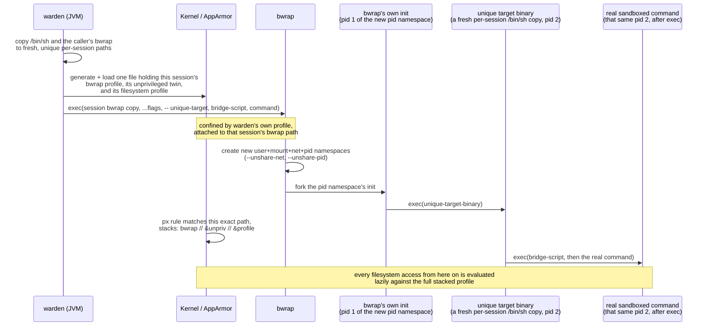
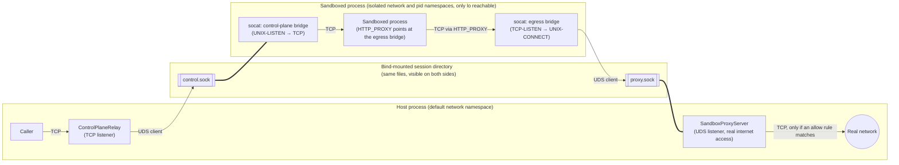

# warden

An OS-level process sandbox for JVM host applications: kernel-enforced filesystem and
network-egress confinement for a subprocess you launch, using each platform's own native
sandboxing primitive - Seatbelt (`sandbox-exec`) on macOS, AppArmor + `bwrap` on Linux.

## What it is, and when to use it

warden wraps `ProcessBuilder`-style process launches in a real, kernel-enforced sandbox.
You give it a filesystem allow/deny rule list and a network host allowlist. It launches
your command inside a boundary the sandboxed process cannot see past, bypass, or
influence - not a convention the process is expected to cooperate with.

Good fit: any JVM application that runs untrusted or semi-trusted subprocesses and needs
real isolation - agent tool-execution (an LLM-driven shell/bash tool), plugin sandboxes,
CI job runners, anything that shells out to code it doesn't fully trust.

Not a fit: multi-tenant container/VM-level isolation. warden confines one process tree on
the *existing* kernel. It does not virtualize one.

## How it differs from other approaches in this space

- Most tools in this space ship as a separate CLI/runtime with its own language-ecosystem
  dependency (commonly Node.js). warden is a native JVM library with zero non-JDK runtime
  dependency, embedded directly into the host process rather than shelled out to.
- Container/VM-based sandboxing trades weight (a container runtime/daemon, per-container
  overhead) for isolation strength. warden uses OS-native primitives directly (Seatbelt
  profiles, Linux namespaces + a Linux Security Module) - lighter, no daemon, per-process
  rather than per-container.
- A common simplification other Linux sandboxing tools take, once they hit Ubuntu
  23.10+'s unprivileged-userns restriction, is globally unconfining the
  namespace-creation binary for *every* process on the machine. That closes the
  restriction's error message but reopens a real gap: any process that execs that binary - not
  just the intended sandboxed one - silently gains unconfined status. warden
  instead does genuine per-session AppArmor profile stacking, scoped to exactly the one
  session being launched - no global unconfinement, at the cost of being a less-trodden
  path (see Limitations below).
- Network egress in many lightweight approaches relies on `HTTP_PROXY`/`HTTPS_PROXY`
  environment variables alone - a convention a subprocess can simply ignore (raw sockets,
  `--noproxy` flags, proxy-unaware runtimes). warden's Linux egress control is backed by a
  real, kernel-enforced network namespace with no route out except through the proxy
  relay it builds - ignoring the env vars still doesn't reach the network.

## Design rationale: why this, not that

A few of warden's design choices came from real dead ends, not just picking the obvious
option first. Worth knowing before you dig into the implementation:

**Linux filesystem enforcement is AppArmor, not fanotify.** A `fanotify`-based design was
built and spiked first - `FAN_MARK_FILESYSTEM` was the only mark scope that actually
worked across a bind-mounted sandbox boundary, but it covers the *entire* filesystem, not
just sandboxed sessions: the listener process becomes the real-time permission authority
for every process on that filesystem, sandboxed or not. A dedicated listener-death spike
then found a fail-**open** result - killing the listener let an already-pending,
already-blocked file open resolve successfully with nothing ever answering it, on real
Linux, immediately. That's a direct violation of "fail closed, no exceptions," not a
tolerable edge case, and it carries a structural risk of hanging or denying *ordinary
host activity* system-wide if the permission authority ever mishandles an unattributed
event. AppArmor (a Linux Security Module) gives the same lazy, per-access-time rule
evaluation Seatbelt already provides on macOS, but scoped per-*process* - confirmed
empirically that an unconfined process can read a file a confined sibling is denied,
completely unaffected, and nothing about it depends on a live daemon process staying
healthy.

**Real per-session AppArmor profile stacking, not a bwrap-only static mount plan.**
bwrap's own mount table is decided once, before the sandboxed process starts, with no
hook for "evaluate this pattern against whatever path gets opened, whenever it gets
opened" - so credential-glob rules that can match at arbitrary depth (`.env`, `*.pem`,
etc.) can't be expressed as static mounts without either an upfront filesystem walk
(rejected as a real cost on large working trees) or accepting a mid-session drift gap (a
file created *after* the sandbox started that should have been denied). AppArmor closes
this the same way it closes the fanotify gap above - real lazy evaluation, confirmed
against a file created after the profile was already loaded.

Attaching a dynamically-generated, per-session profile to a process launched *through*
bwrap needs a real exec-time transition, not just "load a profile and hope":


```mermaid
sequenceDiagram
    participant Caller as warden (JVM)
    participant Kernel as Kernel / AppArmor
    participant Bwrap as bwrap
    participant Init as bwrap's own init<br/>(pid 1 of the new pid namespace)
    participant Target as unique target binary<br/>(a fresh per-session /bin/sh copy, pid 2)
    participant Sandboxed as real sandboxed command<br/>(that same pid 2, after exec)

    Caller->>Caller: copy /bin/sh and the caller's bwrap<br/>to fresh, unique per-session paths
    Caller->>Kernel: generate + load one file holding this session's<br/>bwrap profile, its unprivileged twin,<br/>and its filesystem profile
    Caller->>Bwrap: exec(session bwrap copy, ...flags, -- unique-target, bridge-script, command)
    Note over Bwrap,Kernel: confined by warden's own profile,<br/>attached to that session's bwrap path
    Bwrap->>Bwrap: create new user+mount+net+pid namespaces<br/>(--unshare-net, --unshare-pid)
    Bwrap->>Init: fork the pid namespace's init
    Init->>Target: exec(unique-target-binary)
    Kernel->>Kernel: px rule matches this exact path,<br/>stacks: bwrap // &unpriv // &profile
    Target->>Sandboxed: exec(bridge-script, then the real command)
    Note over Sandboxed,Kernel: every filesystem access from here on is evaluated<br/>lazily against the full stacked profile
```

**warden brings its own bwrap profile rather than extending the distribution's.** An
AppArmor profile attaches by resolved exec path, and Ubuntu's `bwrap-userns-restrict`
names `/usr/bin/bwrap`. A caller supplying its own bwrap - a vendored copy, the normal
case for an embedder that will not trust `PATH` - is therefore covered by no vendor
profile at all. Where `kernel.apparmor_restrict_unprivileged_userns` is on, that
launch fails loudly. Where an administrator has turned it off, it succeeds and **the
payload runs unconfined**.

The unique per-session paths are what make a session's policy apply to exactly that
session. They are not a convenience: two profiles attached to one exec path attach
*neither* (measured - the launch fails as if unconfined), so a shared bwrap path cannot
carry per-session rules. And the transition into the filesystem profile is `px`, naming
that profile, rather than the `pix` the vendor profile uses: `pix` falls back to inherit
when nothing attaches, which measured as a payload running under the two permissive
profiles alone and reading paths its own rules denied. With `px` the exec is refused and
the payload never starts.

**AppArmor's own rule-resolution semantics are pure set subtraction, not
specificity-aware - and that shaped the glob-rewriting algorithm here.** Verified
empirically: `allow` and `deny` resolve as (∪allow − ∪deny), with no concept of "more
specific wins." A narrow `deny` carved out of a broad `allow` works. The *reverse* - a
narrow `allow` meant to carve an exception out of a broader `deny` glob - does not, no
matter what order the rules are written in. This is a real, load-bearing difference from
macOS's own SBPL (confirmed separately to be genuinely last-clause-wins, order-sensitive) - exactly
the kind of assumption that's easy to get backwards without testing against the
real kernel. `AppArmorDenyGlobExclusion` rewrites a deny glob into narrower clauses that
structurally exclude one specific higher-priority allow path, restoring the intended
precedence by narrowing the deny rather than by ranking the two rules. AppArmor does have
a `priority=` rule qualifier (documented in `apparmor.d(5)`, in the parser from 4.1
onward), and a higher-priority allow does beat an overlapping deny. warden does not use it anywhere, for
a caller's rules or for its own. A generated profile is an  **addition** to whatever policy
is already in force, never a silent override of part of it, and `priority=` exists precisely to override.

**A caller's deny that would break establishment is refused by name, not out-ranked.**
warden reaches a handful of its own paths during a launch: the per-session target binary,
the proxy socket, and the bridge entrypoint and sockets under `/tmp/warden-sandbox-bridge`.
A broad caller deny can cover them by accident - `**/tmp/**` is a shape a credential
blacklist author writes, and it covers `/tmp/**` under the `PathMatcher` semantics rule
patterns are authored against.

**warden's own clauses grant single files, not the trees around them.** Under the real
bwrap mount shape only the target binary is bind-mounted at its own host path, so the
session directory around it is an ordinary writable tmpfs directory inside the sandbox, and
`/tmp/warden-sandbox-bridge` is a bind of the host session directory. Both used to be
granted tree-wide, and both were reachable: measured under a real bwrap launch, the
confined process created arbitrary files under the bridge alias, and executed a binary it
staged in the session tree. The profile now names `<session>/target-shell mrix`,
`<session>/proxy.sock w`, `<bridge>/bridge-entrypoint.sh r`, `<bridge>/proxy.sock rw` and
the two control-socket spellings when a control plane was asked for - and nothing wider.

**An enforcing profile must permit the confined process to signal itself.** A generated
profile carries `signal peer=<profile>` in both the bare and the full stacked spelling, and
nothing wider. The stacked spelling has to list its components in sorted order, because
that is how the kernel renders the label a `peer=` is matched against - measured, with an
unsorted spelling and a deliberately non-matching one as controls.

**`EXTERNAL_DIRECTORY` grants traversal, not a listing.** On Linux a rule naming
`EXTERNAL_DIRECTORY` without `READ` emits the base clause and no trailing-slash companion,
so the directory can be resolved through and stat'ed while `ls` on it is refused. `READ` is
what asks for a listing, and a rule naming it still gets the companion. macOS says the same
thing with `file-read-metadata` instead of `file-read*`, measured under a real
`sandbox-exec`: the listing is refused, a file inside a granted subtree still opens, and the
same directory granted `READ` does list.

**Network isolation uses kernel network namespaces, not shared-namespace proxying.**
Considered and rejected: running the sandboxed process without `--unshare-net` and
relying on proxy env vars alone. A real isolated network namespace (only loopback
reachable, no route out) is what makes egress control actually enforced rather than
conventional - the tradeoff this creates (loopback doesn't cross the namespace boundary,
needing a socket-bridge relay for both the sandboxed process's own egress and any
control-plane channel back into it) is real added complexity, not glossed over:


```mermaid
flowchart LR
    subgraph host["Host process (default network namespace)"]
        caller["Caller"]
        relay["ControlPlaneRelay<br/>(TCP listener)"]
        proxy["SandboxProxyServer<br/>(UDS listener, real internet access)"]
        internet(("Real network"))
    end

    subgraph bridge["Bind-mounted session directory<br/>(same files, visible on both sides)"]
        proxysock[["proxy.sock"]]
        controlsock[["control.sock"]]
    end

    subgraph sandbox["Sandboxed process (isolated network and pid namespaces, only lo reachable)"]
        egress["socat: egress bridge<br/>(TCP-LISTEN &rarr; UNIX-CONNECT)"]
        cpbridge["socat: control-plane bridge<br/>(UNIX-LISTEN &rarr; TCP)"]
        target["Sandboxed process<br/>(HTTP_PROXY points at the egress bridge)"]
    end

    caller -- "TCP" --> relay
    relay -- "UDS client" --> controlsock
    controlsock === cpbridge
    cpbridge -- "TCP" --> target

    target -- "TCP via HTTP_PROXY" --> egress
    egress -- "UDS client" --> proxysock
    proxysock === proxy
    proxy -- "TCP, only if an allow rule matches" --> internet
```

Two independent one-way bridges, each crossing the namespace boundary through the same
bind-mounted Unix domain socket file (the `===` links above - not a proxying hop, the
same underlying file object reachable at two different paths). Egress and control-plane
traffic never share a bridge, and the sandboxed process's `HTTP_PROXY` pointing anywhere
else simply has no route out - `--unshare-net` leaves nothing else reachable.

## Performance

`ControlPlaneRelayLatencyBenchmarkTest` measures real, end-to-end round-trip latency
through the control-plane bridge above (TCP client &rarr; `ControlPlaneRelay` &rarr; UDS
&rarr; UDS server, the exact three-hop path in the diagram). Run it yourself and get
current numbers for your own machine:

```
./gradlew :warden-core:benchmark
```

Real, reproducible numbers from this repo's own development machine (Mac OS X/aarch64, 200
samples, two independent runs): mean 0.30-0.33ms, p50 0.29-0.32ms, p95 0.42-0.49ms.

## Concurrency model

Sessions share nothing. Each one has its own profile names, its own directory under
`/var/lib/warden/sessions`, and its own copy of bwrap, and loads and removes its policy as a
unit. There is no shared file to serialize access to and so no lock between sessions -
verified by a real multi-session concurrent test in which each session enforced its own
rules and was refused the other's paths. A session does hold an exclusive lock, which is what
lets a JVM reclaim the sessions of runs that were killed rather than closed without touching
the live sessions of other JVMs on the machine. That lock file sits beside the session
directory and is taken before the directory is created: while it sat inside, a directory
existed for the length of three mkdirs before anyone held it, and another JVM's sweep read
that as abandoned.

That directory is deliberately not under `java.io.tmpdir`, which is mode 1777. It holds the
bwrap copy warden's confinement profile attaches to, and that profile grants `userns`,
`capability`, `mount` and `pivot_root`. A profile outlives the process it was loaded for
whenever the JVM is killed, so under a world-writable root any local user could recreate the
vacated path, put her own binary at that name and be handed namespace creation the kernel
otherwise refuses her - measured end to end, with the userns sysctl at 1. Every JVM also
sweeps abandoned sessions on its first launch, removing their profiles before deleting the
directory those profiles name.

The privilege model is two-tier: a one-time, privileged (`sudo`) install step per machine
(`scripts/install-apparmor-policy.sh`), then zero privilege needed for every session launch
afterward. That step creates warden's state directories, installs a root-owned helper, and
grants the daemon user passwordless sudo for that one command.

The helper exists because the grant cannot be narrowed in sudoers itself. sudo-rs, the
default sudo on Ubuntu 25.10 and later, rejects a wildcard in a command argument outright,
so `apparmor_parser -r <directory>/*` is not a rule that loads at all - and naming the bare
parser would permit any arguments, which is no narrowing.

**The helper takes no path, and the boundary is what the policy may contain rather than
where it came from.** Bounding a path bounds nothing when the grantee owns the directory it
names: with the daemon user writing warden's own policy directory, a crafted file placed
there unloaded the distribution's `/usr/bin/man` profile, replaced it with a permissive one,
and loaded policy from outside the directory entirely through a symlink the "is this a
regular file" test followed. All measured against the real mechanism.

So the helper's one argument is a 32-hex session id, and it writes every profile header
itself - names, flags and the bwrap attachment. What the daemon user supplies is the rule
body of `warden-sandbox-<id>`, a profile carrying no attachment specification, delivered on
stdin so there is no path to swap. That body may contain no brace, which is what makes the
bound hold: every `{` and `}` in the file the parser sees is one the helper wrote, so every
profile declaration between them is too. A brace in a real directory name does not reach it as
one - it is byte-escaped on the way in.

The include allowlist is the other half of the same invariant, and it names one file rather
than a directory - an `include` is textual, and an abstraction can declare a profile of its
own, so `abstractions/*` would have been a way to bring one in without writing a brace.
`apparmor_parser -N` over the assembled file is the backstop, checked against exactly the
three names the session id yields - and it is a backstop rather than the boundary because it
reports a profile's name and not its attachment: `profile warden-sandbox-<id> /usr/sbin/sshd
{ }` prints only the name while confining sshd.

**What is measured on one distribution here, and what is not.** *Which* shipped abstractions
declare profiles is a property of the distribution, and this project has measured one. Asked
file by file, `apparmor_parser -N` names seven of the ones Ubuntu 26.04 ships, and the
directory holding three of those is an eighth spelling that declares the same profiles. That
is a limit on the survey, not on the allowlist - the allowlist names a single file and reads the same on every
distribution, one counterexample is all the reasoning it supports needs, and another
distribution can only add more. What `<abstractions/base>` itself contains belongs to the
distribution too, and warden neither controls it nor surveys it: `-N` reads through an include
and names what the included file declares, so on a distribution where that file grew a profile
declaration the launch is refused rather than the declaration loaded. That property is
asserted, and the assertion skips itself - visibly - on a machine that ships no
profile-declaring abstraction to ask it with.

What a compromised daemon user can still do is load and remove profiles named
`warden-{bwrap,unpriv,sandbox}-<32 hex>`. The bwrap one attaches to a path inside a session
directory only that same user can write, so it can hand `userns` to a binary that user put
there - which is what warden's normal operation gives it anyway, and reaches no other account
on the machine. The only file it can make a privileged parser open is the one root-owned
abstraction warden itself emits, it cannot replace or unload anything the distribution ships,
and it cannot attach a profile to any executable outside its own session tree. `AppArmorPolicyHelperBoundTest`
is that statement as assertions, run against the installed helper rather than a copy of its text.

## Practical notes for callers

A few things that aren't obvious until you actually launch something, worth knowing
before you hit them yourself (all demonstrated in `examples/warden-example-simple`):

- **Resolve paths with `Path.toRealPath()` before building rules from them, especially
  on macOS.** A system temp directory commonly lands under `/var/folders/...`, itself a
  symlink to `/private/var/folders/...`. Seatbelt enforces against the kernel-resolved
  canonical path, not the symlinked one - a rule built from the raw, non-canonical path
  will silently never match.
- **Every path the sandboxed process touches needs its own grant, including its own log
  file and working directory.** Leaving `workingDirectory` unset means the child
  inherits your JVM's own current directory, which almost certainly has no rule
  covering it. A log/output file living outside your granted paths will fail to write
  to for the same reason.
- **A path outside the sandbox root needs a mount, not just a rule.** On Linux the sandbox
  starts from an empty filesystem, so a path that was never mounted does not exist inside
  it - the process gets an ephemeral directory that vanishes on exit, and a rule covering
  that path has nothing to govern. Declare it with `mountReadOnly(Path)` /
  `mountReadWrite(Path)`, which binds the host path at the same absolute path inside the
  sandbox. Typical case: a persistent profile, cache or state directory living elsewhere
  on the host. A mount only makes the path reachable, access is still decided by the
  filesystem rules, and a mount whose source is missing fails the launch rather than
  silently producing an empty directory. macOS has no mount namespace, every host path is
  already reachable there, so mounts are a no-op on that platform.
- **Say whether you mean a glob or a path.** A rule is matched against a `RulePath`, and there
  are two ways to make one. `RulePath.glob(...)` is the pattern language: `**`, `*`, `?`, and
  `\` escaping whatever follows it. `RulePath.literal(path)` and `RulePath.tree(directory)` take
  a path and mean every character of it, wildcards included; `RulePath.quote(fragment)` is the
  primitive under both, for composing a pattern out of your own wildcards and a path you hold -
  `RulePath.glob(RulePath.quote(root) + "/**/.env")`. Interpolating a path into a glob string
  yourself is the one thing to avoid: a workspace really named `My*Project` spelled that way
  grants every sibling the wildcard matches, measured on both platforms against three of them,
  with no error and nothing in the profile to notice. That is why the question is asked at the
  API rather than guessed at in the translator.
- **A path can contain anything but a double quote.** Whichever way you name it, warden encodes
  a path so that a space, tab, line break, `#`, `,`, `!`, `[`, `]`, `{`, `}`, `\`, `*`, `?`, a
  single quote or any non-ASCII character in a real directory name reaches the kernel as the
  character it is. Measured on both platforms against directories actually created with those
  names, with two decoys each - the character dropped and the character replaced - to catch an
  escape that collapses. The single exception is a double quote, refused outright on both
  platforms with a message naming it: macOS takes a pattern as a regex inside a `#"..."`
  literal whose only terminator is that same character, with no escape for it. AppArmor could
  carry one, and it is refused there too so that one rule list does not mean two different
  policies.
- **A glob supports `**`, `*` and `?` and refuses the rest, loudly.** A `java.nio.file` character
  class (`[...]`) or alternation (`{a,b}`) is refused rather than translated, on both platforms,
  with a message naming the pattern and the two spellings that do work - one rule per
  alternative, or `\{` for a path that really holds a brace. Neither policy language has either
  construct. Emitted as text, `**/*.{pem,key}` becomes a rule about a file named `{pem,key}`:
  measured with a real certificate and key present in a granted tree, on a real kernel and a real
  `sandbox-exec`, it left both readable and was indistinguishable from writing no rule at all,
  while two separate patterns denied both. A refusal is the only one of those outcomes a person
  can act on.
- **Rule order is priority order** - the first rule in your list wins over a later,
  overlapping one. A narrow `deny` meant to carve an exception out of a broader `allow`
  must be listed *before* that `allow`.
- **On macOS, expect a harmless `Error opening /private/var/select/sh: Operation not
  permitted` line on stderr when launching `/bin/sh`.** This is macOS's own shell
  resolving which real shell binary to exec, unrelated to anything your own rules
  configured - safe to ignore, not a sign your sandbox is misconfigured.

## Known limitations

- No TLS termination/inspection at the proxy layer - domain fronting behind a shared CDN
  edge is undetectable at this layer. A limitation shared by this entire class of
  mechanism, not unique to warden.
- SSH-based git remotes don't speak the HTTP CONNECT protocol this proxy implements, so
  they simply won't route through it. A functional gap, not a security one.
- macOS's `sandbox-exec` is undocumented and soft-deprecated by Apple with no public
  replacement API - an ecosystem-wide risk every tool in this space accepts.
- The per-session AppArmor stacking recipe has no known community precedent found during
  this project's own research. Expect to be on your own if it breaks against an untested
  kernel/AppArmor-parser combination.
- A path-based blacklist is defeated by a hard link, on both platforms: a second directory
  entry for the same inode, under a name no rule covers. Bounded by the confined process
  being unable to create one - it can reach neither a directory outside its own grants nor
  the link target it would need.
- A caller supplying a setuid bwrap loses the setuid bit in the per-session copy. That
  costs nothing on a kernel offering unprivileged user namespaces, which is the only kind
  this mechanism works on at all.
- Verified only on Ubuntu/Debian-family with AppArmor active. Fedora is not supported
  (SELinux, not AppArmor). Arch requires manually enabling the AppArmor kernel module -
  see the [ArchWiki](https://wiki.archlinux.org/title/AppArmor).

## Modules

- `warden-api` - the public contract: `SandboxedProcessLauncher`, `SandboxedProcess`,
  `SandboxLaunchRequest`, `FilesystemRule`, `RulePath`, `NetworkRule`, `PathMount`,
  `NetworkAskHandler`. No platform-specific code.
- `warden-core` - the implementation: `OsSandboxedProcessLauncher` (the entry point,
  dispatches to Seatbelt on macOS / AppArmor+bwrap on Linux), profile generation, the
  loopback forward proxy, network-namespace bridging.
- `examples/warden-example-simple` - a minimal, runnable usage sample (sandbox a plain
  shell command with an allow/deny rule), also exercised as a real regression test in CI.
- `examples/warden-example-opencode` - a heavier sample sandboxing a real third-party
  CLI.

## Dependencies

- **Jetty** (`org.eclipse.jetty`) - `warden-core`'s loopback forward proxy and
  the Linux Unix-domain-socket bridge are built on Jetty's `jetty-server`, `jetty-proxy`,
  and `jetty-unixdomain-server` modules rather than hand-rolled socket-relay code.
  Apache-2.0 / EPL-2.0 dual-licensed.
- [OpenCode](https://opencode.ai) is not a warden dependency - it's the real,
  non-trivial third-party CLI `examples/warden-example-opencode` targets, to
  demonstrate warden sandboxing something more realistic than a toy shell command.

## Building

```
./gradlew build
```

## Contributing

Commit messages follow [Conventional Commits](https://www.conventionalcommits.org/en/v1.0.0/)

```
git config core.hooksPath .githooks
```

Both the hook and the CI check run the same `scripts/validate-commit-message.sh`, so
there's nothing to keep in sync between local and CI enforcement.

## License

This project is licensed under the Apache-2.0 License.
